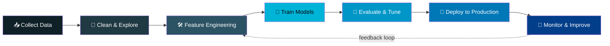
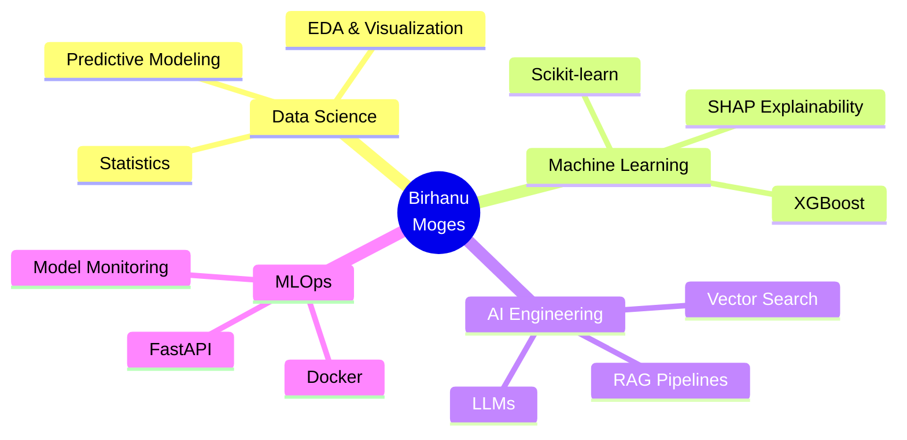

---
<table>
<tr>
<td width="55%" valign="middle">

### 🚀 About Me

-  I'm a **Data Scientist / AI & ML Engineer** passionate about turning raw data into real-world impact.
-  Skilled in **Python**, **Machine Learning**,**Next.js**, **Deep Learning**, **LLM** and **Predictive Modeling**.
-  I love exploring complex datasets, engineering features, and building models that actually ship.
-  Currently deep into **RAG pipelines, and MLOps**.
-  Always learning — from classic statistics to the latest in generative AI.

</td>
<td width="45%">

</td>
</tr>
</table>

 

 

## 🔄 How I Work — From Data to Deployment

 

## 🧩 My Core Focus Areas

---

## 🧰 Tech Stack & Skills

 

 

<table width="100%">
<tr>
<td valign="top" width="50%">

### 💻 Languages

---

### 🤖 Machine Learning / Deep Learning

</td>
<td valign="top" width="50%">

### 📊 Data & Visualization

---

### ☁️ MLOps, Databases & Deployment

</td>
</tr>
</table>

 

<b>🛠️ Tools & Workflow</b>

 

---

## 📈 GitHub Stats

 

 

 

---

## 🧠 Featured Projects

<table>
<tr>
<td width="50%" valign="top" align="center">

 

 

  

</td>
<td width="50%" valign="top" align="center">

 

 

  

</td>
</tr>
</table>

 

---

## 🌐 Connect With Me

  

 

 

 

### ⭐ If you like my work, feel free to follow me and star my repositories!

